# AROMA — Architecture Document

## **AI-powered Repository & Object Model Analyzer**

> Built for the **IBM Bob Hackathon 2026** — *"Turn idea into impact faster"*
> Developed using **IBM Bob IDE** | Powered by **IBM watsonx.ai (Granite 4-h-small)**

---

## Table of Contents

1. [System Overview](#1-system-overview)
2. [High-Level Architecture](#2-high-level-architecture)
3. [Component Architecture](#3-component-architecture)
4. [Data Flow Architecture](#4-data-flow-architecture)
5. [Module Deep Dives](#5-module-deep-dives)
6. [API Route Architecture](#6-api-route-architecture)
7. [State Management Architecture](#7-state-management-architecture)
8. [UI/UX Architecture](#8-uiux-architecture)
9. [Technology Stack](#9-technology-stack)
10. [Database Schema](#10-database-schema)
11. [Security Considerations](#11-security-considerations)
12. [Deployment Architecture](#12-deployment-architecture)
13. [IBM Bob — Development Partnership](#13-ibm-bob--development-partnership)
14. [IBM watsonx.ai — AI Inference Layer](#14-ibm-watsonxai--ai-inference-layer)

---

## 1. System Overview

**AROMA** (AI-powered Repository & Object Model Analyzer) is a full-stack web application that serves as an intelligent development assistant for understanding, maintaining, and improving legacy codebases. The application was built entirely using **IBM Bob IDE** as the primary AI development partner, and it leverages **IBM watsonx.ai** (IBM Granite foundation models) as the AI inference backend for all analysis modules.

AROMA delivers:

- **Code Architecture Exploration** — Instant understanding of complex codebases
- **Interactive Flow Tracing** — Chat-based code flow analysis across repositories
- **Smart Refactoring** — AI detection of deprecated patterns and code smells
- **Documentation & Test Generation** — Context-aware auto-generation
- **Code Health Dashboard** — Real-time quality metrics and visualization
- **Security Scanning** — OWASP Top 10 vulnerability detection

### Key Design Principles

| Principle | Implementation |
|-----------|---------------|
| **AI-First** | Every module uses IBM Granite model inference via watsonx.ai REST API |
| **Full Context** | Complete code input is passed to AI for deep, holistic understanding |
| **Progressive Enhancement** | Fallback demo data when AI is unavailable |
| **Server-Side AI** | All API credentials remain on the server — never exposed to browser |
| **IBM-First Tech Stack** | IBM Bob IDE for development, IBM watsonx.ai for inference |
| **Responsive** | Mobile-first design, works on all screen sizes |

---

## 2. High-Level Architecture

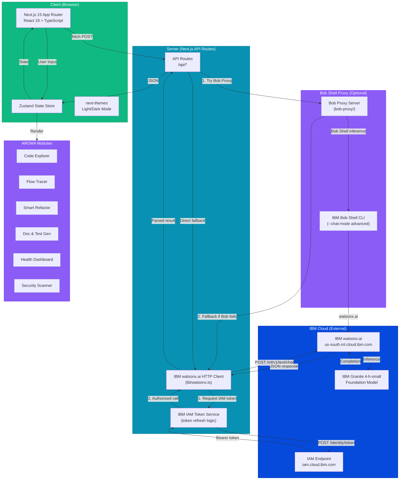

---

## 3. Component Architecture

### 3.1 Directory Structure

```
src/
├── app/
│   ├── layout.tsx              # Root layout with fonts, metadata, toaster
│   ├── page.tsx                # Main SPA page with sidebar + tab routing
│   ├── globals.css             # Global styles, Tailwind 4, theme variables
│   └── api/
│       ├── analyze/route.ts    # Code analysis API (POST)
│       ├── chat/route.ts       # Flow tracer chat API (POST)
│       ├── refactor/route.ts   # Refactoring suggestions API (POST)
│       ├── generate/route.ts   # Doc/test generation API (POST)
│       ├── security/route.ts   # Security scanning API (POST)
│       └── health/route.ts     # System health & watsonx.ai check (GET)
├── components/
│   ├── legacy-code-agent/
│   │   ├── hero-section.tsx    # Landing page with terminal demo
│   │   ├── code-explorer.tsx   # Module 1: Architecture explorer
│   │   ├── flow-tracer.tsx     # Module 2: Interactive chat tracer
│   │   ├── smart-refactor.tsx  # Module 3: Pattern detection
│   │   ├── doc-generator.tsx   # Module 4: Doc & test generator
│   │   ├── dashboard.tsx       # Module 5: Health metrics dashboard
│   │   ├── security-scanner.tsx# Module 6: Vulnerability scanner
│   │   └── canvas-background.tsx # Reusable 2D background component
│   └── ui/                     # shadcn/ui component library (30+ components)
├── store/
│   └── use-app-store.ts        # Zustand global state management
├── hooks/
│   ├── use-mobile.ts           # Mobile detection hook
│   └── use-toast.ts            # Toast notification hook
└── lib/
    ├── watsonx.ts              # IBM watsonx.ai REST client + IAM token manager
    ├── db.ts                   # Prisma database client
    └── utils.ts                # Utility functions (cn, etc.)
```

### 3.2 Component Hierarchy

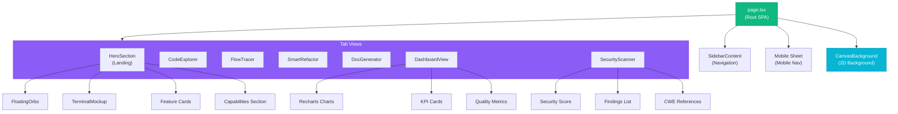

---

## 4. Data Flow Architecture

### 4.1 Primary Data Flow (Code Analysis)

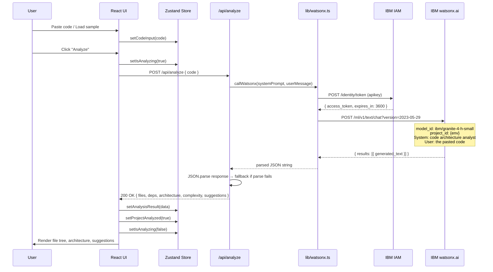

### 4.2 Chat Flow Tracer Data Flow

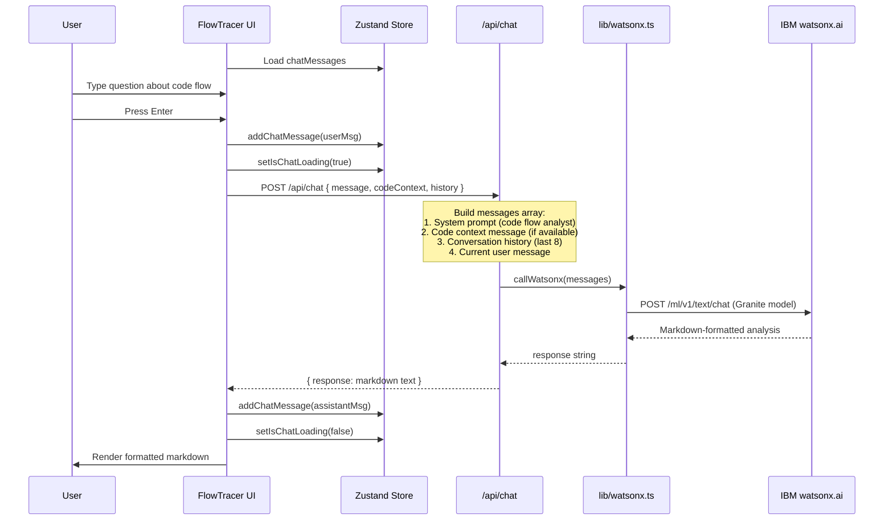

### 4.3 Refactoring Data Flow

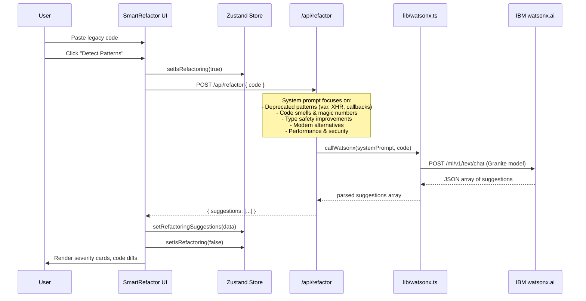

---

## 5. Module Deep Dives

### 5.1 Module Dependency Map

```mermaid
graph LR
    subgraph UI_Layer ["UI Layer"]
        CE[Code Explorer]
        FT[Flow Tracer]
        SR[Smart Refactor]
        DG[Doc Generator]
        DV[Health Dashboard]
        SS[Security Scanner]
    end

    subgraph Shared ["Shared Dependencies"]
        Store[Zustand Store]
        Canvas[CanvasBackground]
        UI_Lib[shadcn/ui Components]
    end

    subgraph Backend ["Backend API"]
        A1[/api/analyze]
        A2[/api/chat]
        A3[/api/refactor]
        A4[/api/generate]
        A5[/api/security]
        WX[lib/watsonx.ts]
    end

    CE --> Store
    CE --> Canvas
    CE --> A1
    
    FT --> Store
    FT --> Canvas
    FT --> A2
    
    SR --> Store
    SR --> Canvas
    SR --> A3
    
    DG --> Store
    DG --> Canvas
    DG --> A4
    
    DV --> Store
    DV --> Canvas
    
    SS --> Store
    SS --> Canvas
    SS --> A5

    A1 --> WX
    A2 --> WX
    A3 --> WX
    A4 --> WX
    A5 --> WX

    style UI_Layer fill:#10b981,stroke:#059669,color:#fff
    style Shared fill:#8b5cf6,stroke:#7c3aed,color:#fff
    style Backend fill:#0891b2,stroke:#0e7490,color:#fff
```

### 5.2 Module Feature Matrix

| Feature | Code Explorer | Flow Tracer | Smart Refactor | Doc & Test Gen | Dashboard | Security Scanner |
|---------|:---:|:---:|:---:|:---:|:---:|:---:|
| Code Input | ✅ | ✅ (shared) | ✅ | ✅ | ❌ (uses explorer) | ✅ |
| AI Analysis (watsonx.ai) | ✅ | ✅ | ✅ | ✅ | ❌ (static) | ✅ |
| Fallback Data | ✅ | ✅ | ✅ | ✅ | ✅ | ✅ |
| Copy to Clipboard | ✅ | ✅ | ✅ | ✅ | ❌ | ✅ |
| Expandable Details | ✅ | ❌ | ✅ | ❌ | ❌ | ✅ |
| Severity Indicators | ❌ | ❌ | ✅ | ❌ | ✅ | ✅ |
| Charts/Visualization | ❌ | ❌ | ❌ | ❌ | ✅ (6 charts) | ❌ |
| Multi-type Output | ❌ | ❌ | ❌ | ✅ (4 types) | ❌ | ❌ |
| Sample Code | ✅ | ❌ (suggestions) | ✅ | ✅ | ❌ | ✅ |

### 5.3 Code Explorer Module

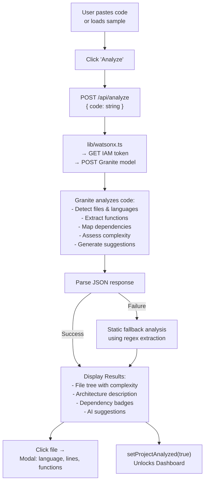

### 5.4 Security Scanner Module

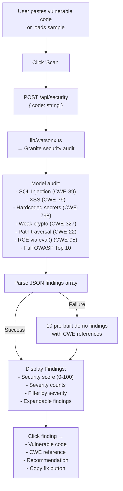

---

## 6. API Route Architecture

### 6.1 API Routes Overview

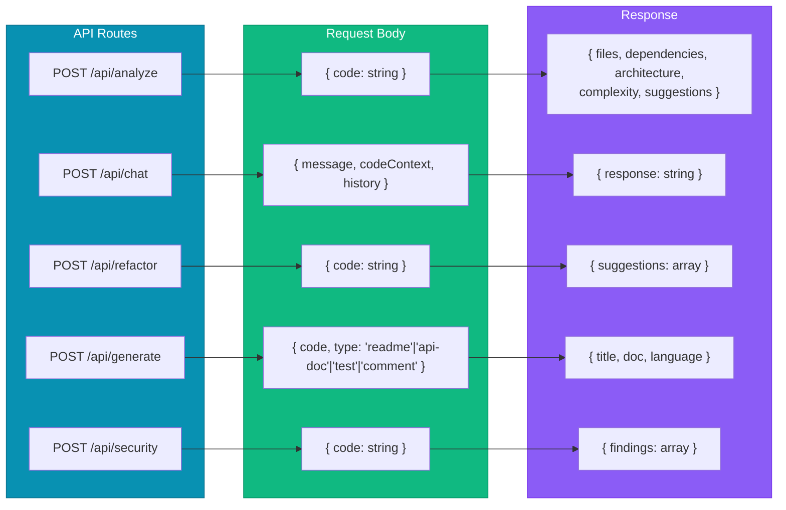

### 6.2 IBM watsonx.ai Integration Pattern

All five API routes share a consistent integration pattern through `lib/watsonx.ts`:

```mermaid
flowchart TD
    Req["Incoming Request"] --> Validate["Validate request body"]
    Validate -->|Invalid| Err400["400 Bad Request"]
    Validate -->|Valid| BuildPrompt["Build system prompt<br/>(task-specific analyst persona)"]
    BuildPrompt --> Messages["Construct messages array:<br/>system + context + user"]
    Messages --> GetToken["lib/watsonx.ts:<br/>Check cached IAM token<br/>(expires_in: 3600s)"]
    GetToken -->|Token valid|     Call["POST us-south.ml.cloud.ibm.com<br/>/ml/v1/text/chat?version=2023-05-29<br/>model: ibm/granite-4-h-small"]
    GetToken -->|Token expired| RefreshToken["POST iam.cloud.ibm.com/identity/token<br/>(grant_type=apikey)"]
    RefreshToken --> Call
    Call -->|Success| ParseJSON["Try parse JSON from<br/>generated_text field"]
    ParseJSON -->|Parsed| Respond["200 OK + structured data"]
    ParseJSON -->|Failed| Fallback["Static fallback / regex extraction"]
    Fallback --> Respond
    Call -->|HTTP Error| Err500["500 Internal Server Error"]

    style GetToken fill:#054ADA,stroke:#0530AD,color:#fff
    style RefreshToken fill:#054ADA,stroke:#0530AD,color:#fff
    style Call fill:#054ADA,stroke:#0530AD,color:#fff
```

### 6.3 System Prompts Architecture

Each API route uses a specialized system prompt defining the analyst persona for that specific task. The prompts instruct the model to return structured JSON for machine-parseable routes or Markdown for conversational routes.

| Route | Analyst Persona | Output Format | Fallback Strategy |
|-------|----------------|--------------|-------------------|
| `/api/analyze` | Code Architecture Analyst | JSON object | Regex-based function/import extraction |
| `/api/chat` | Code Flow Tracer (conversational) | Markdown text | Static flow analysis template |
| `/api/refactor` | Refactoring & Modernization Expert | JSON array | 7 pre-built refactoring suggestions |
| `/api/generate` | Technical Documentation Generator | Markdown / TypeScript | 4 pre-built document templates |
| `/api/security` | Security Auditor (OWASP-aware) | JSON array | 10 pre-built vulnerability findings |

---

## 7. State Management Architecture

### 7.1 Zustand Store Schema

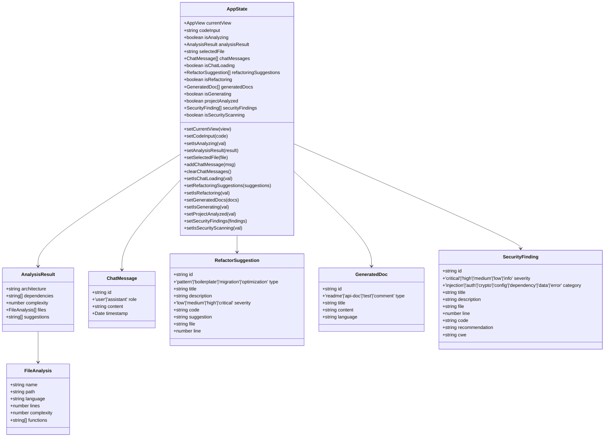

### 7.2 State Update Flow

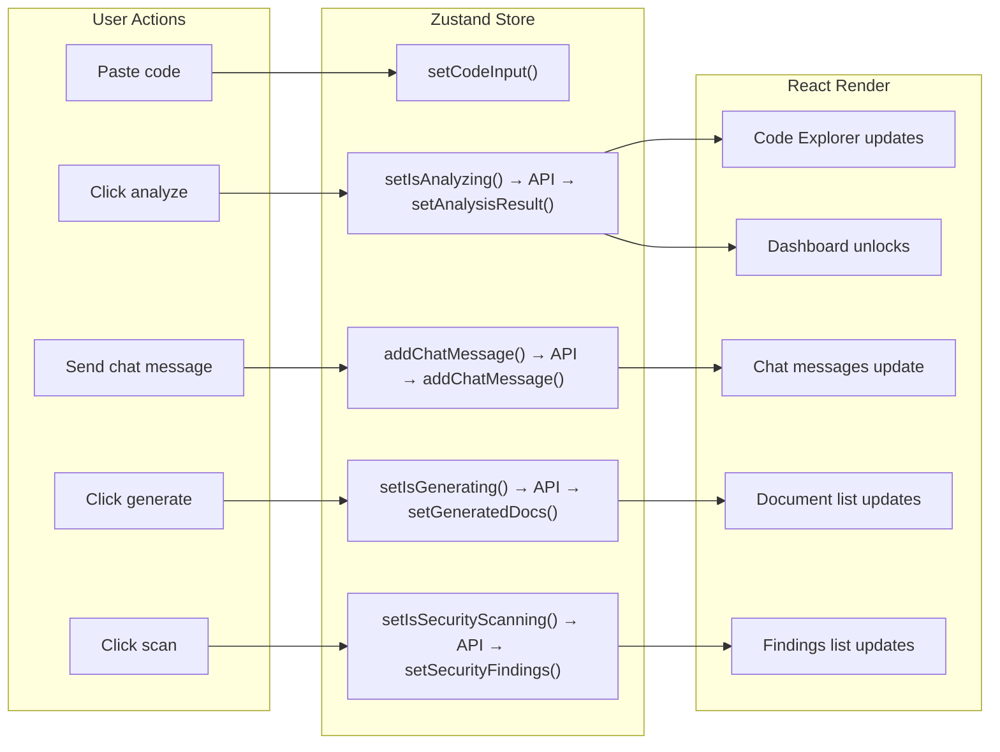

---

## 8. UI/UX Architecture

### 8.1 Layout System

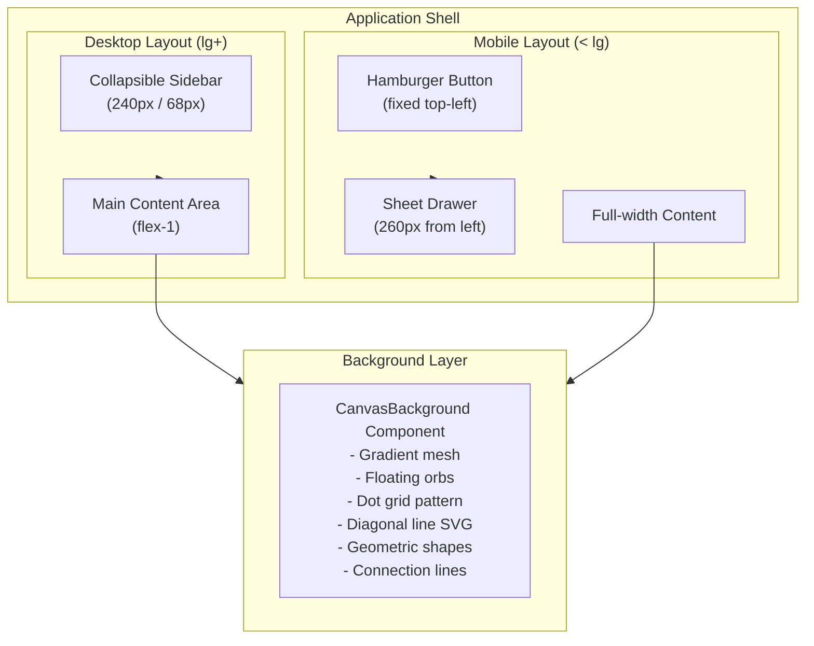

### 8.2 Visual Design System

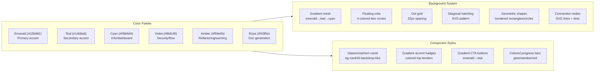

### 8.3 Responsive Breakpoints

| Breakpoint | Width | Sidebar | Grid | Cards |
|-----------|-------|---------|------|-------|
| Mobile | < 640px | Hidden (Sheet) | 1 column | Full width |
| Tablet (sm) | 640–768px | Hidden (Sheet) | 2 columns | Full width |
| Desktop (md) | 768–1024px | Hidden (Sheet) | 2 columns | Side-by-side |
| Large (lg) | 1024–1280px | Collapsible | 2–3 columns | Side-by-side |
| XL (xl) | > 1280px | Expanded | 3 columns | Side-by-side |

---

## 9. Technology Stack

### 9.1 Full Stack Diagram

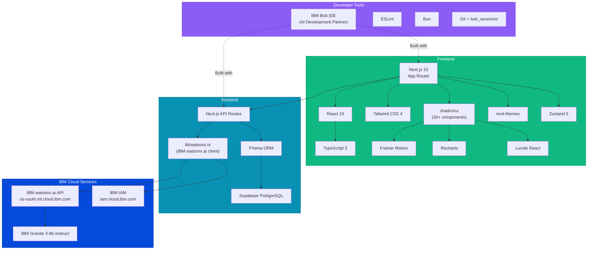

### 9.2 Key Dependencies

| Package | Version | Purpose |
|---------|---------|---------|
| `next` | ^15.x | Full-stack React framework with App Router |
| `react` | ^19.0.0 | UI rendering library |
| `typescript` | ^5 | Type-safe JavaScript |
| `tailwindcss` | ^4 | Utility-first CSS framework |
| `framer-motion` | ^12.x | Animation library |
| `recharts` | ^2.15.x | Charting library |
| `zustand` | ^5.0.x | State management |
| `prisma` | ^6.x | Database ORM |
| `@radix-ui/*` | Various | Headless UI primitives (via shadcn/ui) |
| `lucide-react` | ^0.525.x | Icon library |
| `next-themes` | ^0.4.x | Dark/light mode |
| `react-syntax-highlighter` | ^15.x | Code syntax highlighting |
| `react-markdown` | ^10.x | Markdown rendering |
| `uuid` | ^11.x | Unique ID generation |

> **No third-party AI SDK is used.** All IBM watsonx.ai calls are made via the native `fetch` API to the REST endpoint documented in the IBM Cloud developer access section. This keeps dependencies minimal and credentials fully under developer control.

---

## 10. Database Schema

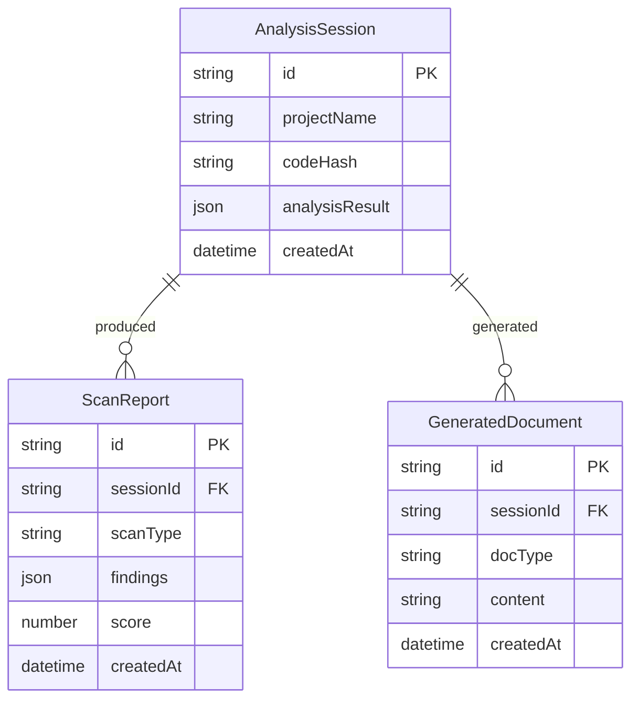

> **Current state:** The Prisma schema is scaffolded with these models for persistence features that allow users to save and retrieve past analysis sessions, scan reports, and generated documents. The database uses **Supabase PostgreSQL** for production and can fall back to SQLite for local development. In the current hackathon proof-of-concept, all data is held in client-side Zustand state for the duration of the browser session, but the database schema is ready for server-side persistence.

---

## 11. Security Considerations

### 11.1 Security Architecture

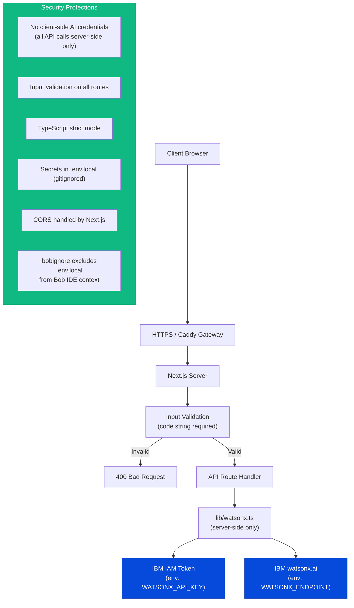

### 11.2 Credential Protection

A `.bobignore` file at the project root ensures that IBM Cloud credentials are never included in Bob IDE's context window during development sessions. This is a requirement when using Bob IDE with any project that contains sensitive configuration files.

```
# .bobignore
.env
.env.local
.env.production
secrets/
*.key
*.pem
```

---

## 12. Deployment Architecture

### 12.1 Current Deployment (Hackathon — Temporary)

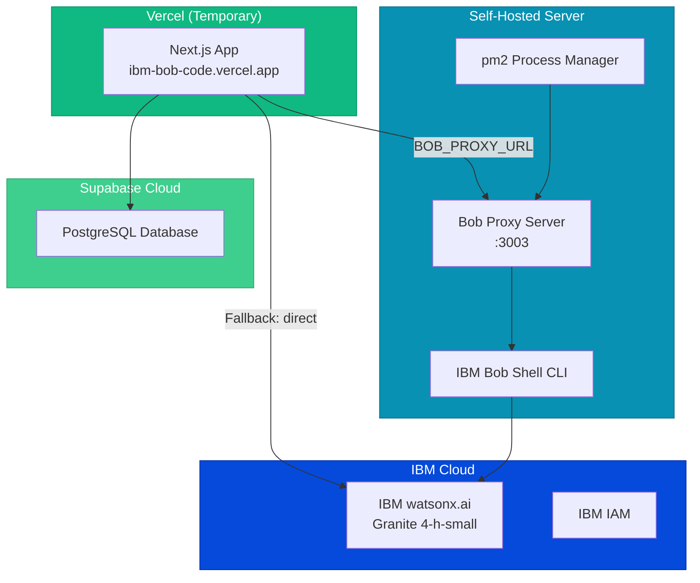

> **Note:** The current Vercel deployment is temporary for the hackathon. After the event, the entire application will run self-hosted on a single server with a custom domain.

### 12.2 Future Deployment (Self-Hosted — Production)

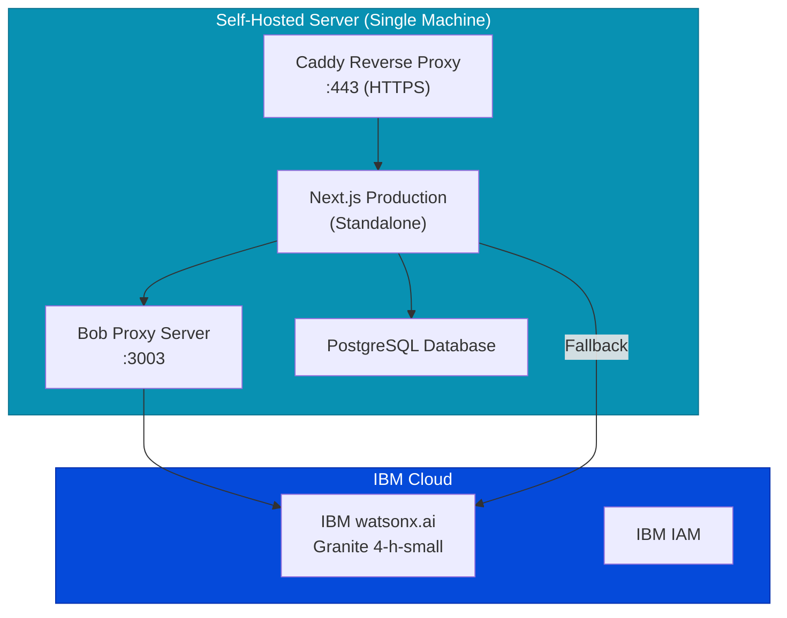

---

## 13. IBM Bob — Development Partnership

### 13.1 The Role of IBM Bob in AROMA

IBM Bob served as the **primary AI development partner** throughout the 48-hour build. Bob is an IDE-level tool — it understands the full repository context, reasons about code intent, and assists developers through planning, implementation, review, and documentation. It is not an API service that AROMA calls at runtime; it is the tool used to *build* AROMA.

This distinction is fundamental: AROMA demonstrates the class of problems that Bob makes tractable — code understanding, documentation, security scanning — and it was itself built using Bob to solve those exact problems during development.

### 13.2 Bob IDE Features Used During Development

```mermaid
graph LR
    subgraph Planning ["Planning Phase"]
        B1["Plan Mode<br/>(feature decomposition)"]
        B2["/init command<br/>(AGENTS.md generation)"]
        B3["Ask Mode<br/>(watsonx.ai API docs)"]
    end

    subgraph Implementation ["Implementation Phase"]
        B4["Code Mode<br/>(all module components)"]
        B5["Literate Coding<br/>(plain English → component)"]
        B6["Next Edit<br/>(tab completion)"]
        B7["Context Mentions<br/>(@lib/watsonx.ts, @api/*)"]
    end

    subgraph QA ["Quality & Review Phase"]
        B8["/review command<br/>(pre-commit code review)"]
        B9["Bob Tips<br/>(complexity warnings)"]
        B10["Auto commit messages"]
        B11["Orchestrator Mode<br/>(multi-module scaffolding)"]
    end

    Planning --> Implementation --> QA

    style Planning fill:#10b981,stroke:#059669,color:#fff
    style Implementation fill:#0891b2,stroke:#0e7490,color:#fff
    style QA fill:#8b5cf6,stroke:#7c3aed,color:#fff
```

### 13.3 Bob Sessions → AROMA Modules Mapping

| Bob Session | Module Built | Key Bob Feature Used |
|-------------|-------------|---------------------|
| Session 001 | Project initialization, Next.js scaffold | `/init` → `AGENTS.md`, Plan mode |
| Session 002 | All five API routes + `lib/watsonx.ts` | Code mode, `@api/*` context mentions |
| Session 003 | Code Explorer + Flow Tracer UI components | Literate coding, Next Edit |
| Session 004 | Smart Refactor + Doc Generator + Dashboard | Orchestrator mode (parallel scaffolding) |
| Session 005 | Security Scanner + end-to-end review | `/review --branch main`, Bob Tips |

### 13.4 AROMA and IBM Bob Share the Same Philosophy

| IBM Bob Design Principle | How Bob Applied It During AROMA Development | AROMA Module That Demonstrates It |
|-------------------------|---------------------------------------------|-----------------------------------|
| "Understands intent, not just syntax" | Bob planned the watsonx.ai integration before a single line was written | Code Explorer — intent-level architecture explanation |
| "Reads complete repository context" | Bob referenced `@api/analyze` when writing `@components/code-explorer` | Flow Tracer — cross-file context awareness |
| "Explains logic with clarity" | Bob generated JSDoc for all exported functions | Doc & Test Generator |
| "Automates complex transformations" | Bob refactored complex conditional logic in the security scanner | Smart Refactoring |
| "Streamlines multi-step work" | Orchestrator mode scaffolded all six UI modules in a single session | Six-module unified workflow |

---

## 14. IBM watsonx.ai — AI Inference Layer

### 14.1 API Architecture

```mermaid
graph TB
    subgraph lib_watsonx ["lib/watsonx.ts"]
        Cache["IAM Token Cache<br/>(in-memory, 60min TTL)"]
        GetToken["getIAMToken()<br/>POST /identity/token"]
        CallWX["callWatsonx()<br/>(messages, systemPrompt)"]
    end

    subgraph IBM_IAM ["IBM IAM"]
        IAMEP["iam.cloud.ibm.com<br/>/identity/token"]
    end

    subgraph IBM_WXAI ["IBM watsonx.ai"]
        ChatEP["us-south.ml.cloud.ibm.com<br/>/ml/v1/text/chat"]
        Granite["ibm/granite-4-h-small"]
    end

    Cache -->|Token valid| CallWX
    Cache -->|Token expired| GetToken
    GetToken --> IAMEP
    IAMEP --> Cache
    CallWX --> ChatEP
    ChatEP --> Granite
    Granite --> CallWX

    style lib_watsonx fill:#0891b2,stroke:#0e7490,color:#fff
    style IBM_IAM fill:#054ADA,stroke:#0530AD,color:#fff
    style IBM_WXAI fill:#054ADA,stroke:#0530AD,color:#fff
```

### 14.2 Environment Configuration

| Environment Variable | Description | Required |
|---------------------|-------------|----------|
| `WATSONX_API_KEY` | IBM Cloud API key (from Developer Access panel) | ✅ Yes |
| `WATSONX_PROJECT_ID` | watsonx.ai project ID (watsonx Hackathon Sandbox) | ✅ Yes |
| `WATSONX_ENDPOINT` | Regional endpoint URL (`https://us-south.ml.cloud.ibm.com`) | ✅ Yes |
| `WATSONX_MODEL_ID` | Foundation model ID (`ibm/granite-4-h-small`) | ✅ Yes |
| `BOB_PROXY_URL` | Bob Shell proxy URL (optional, e.g. `http://localhost:3003`) | ❌ Optional |

### 14.3 Model Configuration Per Route

| API Route | Temperature | Max Tokens | Rationale |
|-----------|-------------|------------|-----------|
| `/api/analyze` | 0.1 | 2000 | Deterministic JSON extraction |
| `/api/chat` | 0.3 | 1500 | Slightly creative for explanations |
| `/api/refactor` | 0.1 | 2000 | Consistent pattern detection |
| `/api/generate` | 0.4 | 3000 | More creative for documentation prose |
| `/api/security` | 0.05 | 2000 | Highly deterministic for security findings |

### 14.4 Models Explicitly Not Used

Per hackathon guidelines, the following models are **out of scope** and are not referenced anywhere in AROMA:
- `llama-3-405b-instruct`
- `mistral-medium-2505`
- `mistral-small-3-1-24b-instruct-2503`

---

## Appendix: Request/Response Schemas

### POST /api/analyze

```json
// Request
{ "code": "string" }

// Response
{
  "files": [{ "name": "string", "language": "string", "lines": "number", "complexity": "number", "functions": ["string"] }],
  "dependencies": ["string"],
  "architecture": "string",
  "complexity": "number",
  "suggestions": ["string"]
}
```

### POST /api/chat

```json
// Request
{ "message": "string", "codeContext": "string", "history": [{ "role": "string", "content": "string" }] }

// Response
{ "response": "string (markdown)" }
```

### POST /api/refactor

```json
// Request
{ "code": "string" }

// Response
{
  "suggestions": [{
    "id": "string", "type": "pattern|boilerplate|migration|optimization",
    "title": "string", "description": "string", "severity": "low|medium|high|critical",
    "code": "string", "suggestion": "string", "file": "string", "line": "number"
  }]
}
```

### POST /api/generate

```json
// Request
{ "code": "string", "type": "readme|api-doc|test|comment" }

// Response
{ "title": "string", "doc": "string", "language": "string" }
```

### POST /api/security

```json
// Request
{ "code": "string" }

// Response
{
  "findings": [{
    "severity": "critical|high|medium|low|info",
    "category": "injection|auth|crypto|config|dependency|data|error",
    "title": "string", "description": "string", "file": "string",
    "line": "number", "code": "string", "recommendation": "string", "cwe": "string"
  }]
}
```

---

*AROMA — IBM Bob Hackathon 2026*  
*Built with IBM Bob IDE | Powered by IBM watsonx.ai Granite 4-h-small*