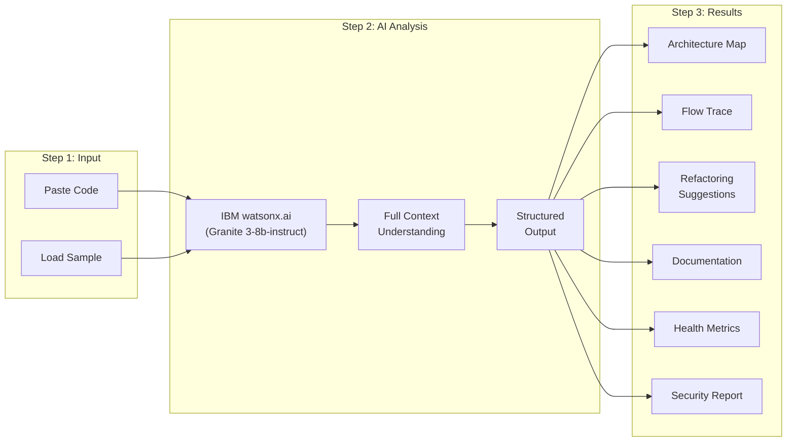

# 🤖 AROMA

## **AI-powered Repository & Object Model Analyzer**

<p align="center">
  <strong>Built for the IBM Bob Hackathon 2026</strong><br/>
  <em>"Turn idea into impact faster"</em>
</p>

<p align="center">
  
  
  
  
  
  
  
</p>

---

## 📋 Table of Contents

- [What is AROMA?](#-what-is-aroma)
- [The Challenge](#-the-challenge)
- [Our Solution](#-our-solution)
- [Six AI-Powered Modules](#-six-ai-powered-modules)
- [How It Works](#-how-it-works)
- [Tech Stack](#-tech-stack)
- [Getting Started](#-getting-started)
- [Project Structure](#-project-structure)
- [API Documentation](#-api-documentation)
- [IBM Bob — Development Partner](#-ibm-bob--development-partner)
- [IBM watsonx.ai — AI Inference Backend](#-ibm-watsonxai--ai-inference-backend)
- [Bob Session Reports](#-bob-session-reports)
- [Screenshots & Demos](#-screenshots--demos)
- [Team & Credits](#-team--credits)
- [License](#-license)

---

## 🤔 What is AROMA?

**AROMA** stands for **A**I-powered **R**epository & **O**bject **M**odel **A**nalyzer — a comprehensive web-based development tool that helps developers understand, maintain, and improve legacy codebases using AI.

Imagine inheriting a 10-year-old monolith with 847 files, no documentation, and zero tests. AROMA's AI-powered modules analyze the entire codebase context to:

- 🗺️ **Map the architecture** instantly — understand what exists and how it connects
- 🔍 **Trace data flows** interactively — chat with AI to follow code paths across files
- 🔧 **Detect anti-patterns** — find deprecated APIs, code smells, and refactoring opportunities
- 📝 **Generate documentation** — produce production-ready README, API docs, tests, and inline comments
- 📊 **Monitor code health** — visualize complexity trends, test coverage, and technical debt
- 🛡️ **Scan for vulnerabilities** — detect SQL injection, XSS, hardcoded secrets, and OWASP Top 10 issues

> **Powered by IBM watsonx.ai** — AROMA uses IBM Granite foundation models to deliver analysis that understands not just individual files, but the entire system's architecture and intent. The entire application was developed using **IBM Bob IDE** as the primary AI development partner.

---

## 🎯 The Challenge

### IBM Bob Hackathon 2026

The hackathon challenges participants to:

> *"Turn idea into impact faster — create a solution that speeds the way you work every day."*

Specific focus areas include:
- ✅ **Get up to speed on existing code quickly**
- ✅ **Generate documentation and tests**
- ✅ **Reduce effort spent on repetitive tasks**

### The Problem We're Solving

Developers spend **30-50% of their time** on code understanding rather than building. Legacy codebases are particularly painful because:

1. **No documentation** — Understanding code requires reading every file manually
2. **Hidden dependencies** — Changes in one file break seemingly unrelated features
3. **No test coverage** — Fear of refactoring leads to accumulating technical debt
4. **Security blind spots** — Hardcoded secrets, SQL injection, and XSS vulnerabilities lurk undetected
5. **Context switching** — Switching between tools (IDE, terminal, browser) kills productivity

AROMA addresses **all five pain points** in a single, unified web application.

---

## 💡 Our Solution

AROMA is a **proof-of-concept** that was entirely planned, architected, and coded using **IBM Bob IDE** as the intelligent development partner. The application itself is a developer tool that demonstrates the class of problems IBM Bob helps solve: understanding, documenting, and modernizing complex codebases.

### Key Design Decisions

| Decision | Rationale |
|----------|-----------|
| **Web application** (not IDE plugin) | Accessible anywhere, no installation required, demo-friendly for hackathon |
| **6 specialized modules** | Deep functionality per task vs. one shallow "do everything" chatbot |
| **Manual code input** | Privacy-preserving, no repository access required, works in sandbox |
| **AI-first with fallbacks** | Always responsive even without network — demo-ready |
| **Rich visualization** | Charts, severity indicators, code diffs — not just text output |
| **IBM watsonx.ai backend** | Official IBM AI platform, Granite models, fully compliant with hackathon |

### How AROMA Embodies the Hackathon Theme

IBM Bob helped build AROMA by doing exactly what AROMA itself enables for its users:

| IBM Bob Capability Used During Development | AROMA Module That Embodies It |
|-------------------------------------------|-------------------------------|
| Explained existing code logic with clarity | Code Explorer — Architecture Mapping |
| Traced data flows across files | Flow Tracer — Interactive Code Analysis |
| Detected anti-patterns and suggested refactors | Smart Refactoring — Pattern Detection |
| Generated JSDoc and inline documentation | Doc & Test Generator |
| Identified potential security issues | Security Scanner |

---

## 🧩 Six AI-Powered Modules

### 1. 🏗️ Code Explorer — Architecture Mapping

**The "What exists?" module.**

| Feature | Description |
|---------|-------------|
| File Detection | AI identifies files, languages, and line counts |
| Function Extraction | Lists all functions/methods with complexity scores |
| Dependency Mapping | Visualizes import chains and inter-file dependencies |
| Architecture Summary | 1–2 sentence description of the design pattern |
| AI Suggestions | 5 actionable improvement recommendations |

**AI Input:** Full code context → **AI Output:** `{ files, dependencies, architecture, complexity, suggestions }`

---

### 2. 🔀 Flow Tracer — Interactive Code Flow Analysis

**The "How does it work?" module.**

| Feature | Description |
|---------|-------------|
| Conversational Chat | Ask AI anything about your codebase |
| Flow Tracing | Follow data from endpoints through services to databases |
| Dependency Mapping | See how modules and functions interact |
| Architecture Explanation | Understand WHY code is structured this way |
| Bottleneck Detection | Find potential issues in code paths |
| Conversation History | Context-aware multi-turn conversations (last 8 messages) |

**AI Input:** `{ message, codeContext, history }` → **AI Output:** Markdown-formatted analysis

---

### 3. 🔧 Smart Refactoring — Pattern Detection & Code Improvement

**The "What should I fix?" module.**

| Feature | Description |
|---------|-------------|
| Pattern Detection | Finds deprecated APIs (var, XHR, callback hell) |
| Code Smell Detection | Identifies magic numbers, duplication, long functions |
| Severity Scoring | Critical/High/Medium/Low classification |
| Code Diff View | Before/after comparison with one-click copy |
| Type Safety | Suggests TypeScript improvements |
| Migration Guide | Modern alternatives (async/await, const/let, fetch API) |

**AI Input:** Full code context → **AI Output:** `[{ type, severity, title, code, suggestion, file, line }]`

---

### 4. 📝 Doc & Test Generator — Context-Aware Documentation

**The "How do I document this?" module.**

| Generation Type | Description |
|----------------|-------------|
| **README.md** | Project overview, architecture, setup, API reference, security |
| **API Documentation** | Endpoint reference with request/response examples, status codes |
| **Test Suite** | Vitest-compatible tests with mocks, happy path, edge cases, error scenarios |
| **Inline Comments** | JSDoc/TSDoc annotations, parameter docs, inline explanations |

**AI Input:** `{ code, type }` → **AI Output:** `{ title, doc, language }`

---

### 5. 📊 Health Dashboard — Real-Time Code Quality Metrics

**The "How healthy is my code?" module.**

| Chart | Metric |
|-------|--------|
| Health Trend | Health score, test coverage, tech debt over 8 weeks |
| Language Distribution | Pie chart of languages used |
| Module Complexity | Bar chart of complexity per module |
| Quality Radar | 6-axis radar: coverage, quality, docs, type safety, modularity, error handling |
| Top Issues | Ranked list with severity badges and file references |
| Quality Breakdown | Progress bars for each quality metric |
| AI Summary | AI-generated actionable insights with time estimates |

**Data Source:** Populated after Code Explorer analysis (requires `projectAnalyzed: true`)

---

### 6. 🛡️ Security Scanner — Vulnerability Detection

**The "Is my code safe?" module.**

| Feature | Description |
|---------|-------------|
| OWASP Top 10 | SQL injection, XSS, broken auth, security misconfiguration |
| Hardcoded Secrets | API keys, passwords, JWT secrets |
| Weak Cryptography | MD5, DES, hardcoded encryption keys |
| Path Traversal | `../` directory traversal attacks |
| Remote Code Execution | `eval()`, `Function()`, command injection |
| CWE References | Each finding linked to CWE classification |
| Security Score | 0–100 score calculated from severity weights |
| Severity Filtering | Filter by critical/high/medium/low/info |
| Expandable Findings | Vulnerable code + fix recommendation per finding |

**AI Input:** Full code context → **AI Output:** `[{ severity, category, title, code, recommendation, cwe }]`

---

## 🔄 How It Works



### User Flow

1. **Land** → See the interactive terminal demo and feature overview
2. **Navigate** → Click any module from the sidebar
3. **Input Code** → Paste your code or load a pre-built sample
4. **Analyze** → Click the action button (Analyze, Trace, Detect, Generate, Scan)
5. **Review** → Browse AI-generated insights, charts, and recommendations
6. **Iterate** → Refine input, try different modules, cross-reference findings

---

## 🛠️ Tech Stack

### Core Framework

| Technology | Version | Purpose |
|-----------|---------|---------|
| **Next.js** | 15.x | Full-stack React framework (App Router) |
| **React** | 19.0 | UI library |
| **TypeScript** | 5 | Type safety |
| **Tailwind CSS** | 4 | Utility-first styling |
| **shadcn/ui** | Latest | 30+ accessible UI components |
| **Bun** | Latest | JavaScript runtime & package manager |

### AI & Backend

| Technology | Purpose |
|-----------|---------|
| **IBM watsonx.ai REST API** | AI inference — IBM Granite 3-8b-instruct foundation model |
| **IBM IAM Token Service** | Bearer token authentication for watsonx.ai API |
| **Next.js API Routes** | Server-side endpoints (AI credentials never exposed to client) |
| **Prisma + SQLite** | Persistence layer for future analysis history (scaffolded) |

### Frontend Libraries

| Technology | Purpose |
|-----------|---------|
| **Framer Motion** | Page transitions, animations, layout animations |
| **Recharts** | Health Dashboard charts (Area, Bar, Pie, Radar) |
| **Zustand** | Client-side state management |
| **Lucide React** | Icon library (100+ icons used) |
| **next-themes** | Light/dark mode support |
| **react-markdown** | Markdown rendering in chat messages |
| **react-syntax-highlighter** | Code syntax highlighting |

### Developer Tools & AI Partner

| Technology | Purpose |
|-----------|---------|
| **IBM Bob IDE** | Primary AI development partner used throughout the entire build |
| **ESLint** | Code linting (Next.js config) |
| **Radix UI** | Accessible headless UI primitives |
| **class-variance-authority** | Component variant styling |

---

## 🚀 Getting Started

### Prerequisites

- **Bun** (recommended) or Node.js 18+
- A modern web browser
- IBM Cloud account with watsonx.ai access (see IBM Bob Setup Guide)

### Environment Variables

Create a `.env.local` file in the project root. All AI calls are made server-side; these values are never exposed to the browser.

```bash
# IBM watsonx.ai — required for all AI analysis modules
WATSONX_API_KEY=your_ibm_cloud_api_key
WATSONX_PROJECT_ID=your_watsonx_project_id
WATSONX_ENDPOINT=https://us-south.ml.cloud.ibm.com
WATSONX_MODEL_ID=ibm/granite-3-8b-instruct

# Optional: override region if your project is not in Dallas
# WATSONX_ENDPOINT=https://eu-de.ml.cloud.ibm.com
```

Refer to the [IBM watsonx.ai Developer Access guide](https://dataplatform.cloud.ibm.com/docs/content/wsj/analyze-data/fm-api.html) to obtain your API key and project ID from the watsonx.ai dashboard.

### Installation

```bash
# Clone the repository
git clone https://github.com/your-username/aroma.git
cd aroma

# Install dependencies
bun install

# Set up environment variables
cp .env.example .env.local
# Edit .env.local with your IBM Cloud credentials

# Set up database (scaffolded for future persistence features)
bun run db:push

# Start development server
bun run dev
```

The application will be available at `http://localhost:3000`.

### Scripts

| Command | Description |
|---------|-------------|
| `bun run dev` | Start development server (port 3000) |
| `bun run build` | Build for production |
| `bun run lint` | Run ESLint code quality checks |
| `bun run db:push` | Push Prisma schema to database |
| `bun run db:generate` | Generate Prisma client |
| `bun run db:migrate` | Run database migrations |
| `bun run db:reset` | Reset database |

---

## 📁 Project Structure

```
aroma/
├── src/
│   ├── app/
│   │   ├── layout.tsx              # Root layout (fonts, metadata, theme)
│   │   ├── page.tsx                # Main SPA with sidebar + tab routing
│   │   ├── globals.css             # Global styles (Tailwind 4, CSS variables)
│   │   └── api/
│   │       ├── analyze/route.ts    # Code architecture analysis
│   │       ├── chat/route.ts       # Interactive flow tracing
│   │       ├── refactor/route.ts   # Refactoring suggestions
│   │       ├── generate/route.ts   # Documentation & test generation
│   │       └── security/route.ts   # Security vulnerability scanning
│   ├── components/
│   │   ├── legacy-code-agent/
│   │   │   ├── hero-section.tsx    # Landing page (terminal demo, features)
│   │   │   ├── code-explorer.tsx   # Module 1: Architecture explorer
│   │   │   ├── flow-tracer.tsx     # Module 2: Chat-based flow analysis
│   │   │   ├── smart-refactor.tsx  # Module 3: Pattern detection
│   │   │   ├── doc-generator.tsx   # Module 4: Doc & test generation
│   │   │   ├── dashboard.tsx       # Module 5: Health metrics (Recharts)
│   │   │   ├── security-scanner.tsx# Module 6: Vulnerability detection
│   │   │   └── canvas-background.tsx # 2D canvas-style background
│   │   └── ui/                     # shadcn/ui components (30+)
│   ├── store/
│   │   └── use-app-store.ts        # Zustand global state
│   ├── hooks/
│   │   ├── use-mobile.ts           # Mobile detection
│   │   └── use-toast.ts            # Toast notifications
│   └── lib/
│       ├── watsonx.ts              # IBM watsonx.ai API client & IAM token helper
│       ├── db.ts                   # Prisma database client
│       └── utils.ts                # Utilities (cn, etc.)
├── bob_sessions/                   # ⬅️ REQUIRED: IBM Bob IDE task session reports
│   ├── README.md                   # Index of all Bob sessions with descriptions
│   ├── session-001-project-init/
│   │   ├── screenshot.png          # Task consumption summary screenshot
│   │   └── task-history.md         # Exported Bob task history (markdown)
│   ├── session-002-api-routes/
│   │   ├── screenshot.png
│   │   └── task-history.md
│   ├── session-003-ui-modules/
│   │   ├── screenshot.png
│   │   └── task-history.md
│   ├── session-004-watsonx-integration/
│   │   ├── screenshot.png
│   │   └── task-history.md
│   └── session-005-security-scanner/
│       ├── screenshot.png
│       └── task-history.md
├── prisma/
│   └── schema.prisma               # Database schema (SQLite)
├── public/                         # Static assets
├── .env.example                    # Environment variable template
├── .env.local                      # Local credentials (gitignored)
├── .gitignore                      # Includes .env.local, secrets
├── ARCHITECTURE.md                 # Detailed architecture document
├── README.md                       # This file
├── package.json                    # Dependencies & scripts
└── Caddyfile                       # Caddy reverse proxy config
```

> **Security note:** Never commit `.env.local` to the repository. The `.gitignore` already excludes it. Exposing IBM Cloud API keys in a public repository will result in immediate credential deactivation by the IBM Security team.

---

## 📡 API Documentation

All API routes are `POST` endpoints that accept JSON and return JSON. The IBM watsonx.ai client is used exclusively on the server side — API keys and project IDs are never sent to the browser.

### `POST /api/analyze`

Analyze code architecture and detect files, functions, dependencies.

```bash
curl -X POST /api/analyze \
  -H "Content-Type: application/json" \
  -d '{"code": "function hello() { return \"world\"; }"}'
```

**Response:** `{ files, dependencies, architecture, complexity, suggestions }`

---

### `POST /api/chat`

Interactive flow tracing with conversation history.

```bash
curl -X POST /api/chat \
  -H "Content-Type: application/json" \
  -d '{"message": "How does data flow from API to database?", "codeContext": "...", "history": []}'
```

**Response:** `{ response: "markdown formatted analysis" }`

---

### `POST /api/refactor`

Detect refactoring opportunities and code smells.

```bash
curl -X POST /api/refactor \
  -H "Content-Type: application/json" \
  -d '{"code": "var x = 1; for(var i=0; i<10; i++) { x = x + i; }"}'
```

**Response:** `{ suggestions: [{ id, type, severity, title, code, suggestion, file, line }] }`

---

### `POST /api/generate`

Generate documentation or tests for code.

```bash
curl -X POST /api/generate \
  -H "Content-Type: application/json" \
  -d '{"code": "export function add(a, b) { return a + b; }", "type": "test"}'
```

**Response:** `{ title, doc, language }`

**Types:** `readme`, `api-doc`, `test`, `comment`

---

### `POST /api/security`

Scan code for security vulnerabilities.

```bash
curl -X POST /api/security \
  -H "Content-Type: application/json" \
  -d '{"code": "db.query(\"SELECT * FROM users WHERE id = \" + userId)"}'
```

**Response:** `{ findings: [{ severity, category, title, description, code, recommendation, cwe }] }`

---

## 🤝 IBM Bob — Development Partner

IBM Bob served as the **primary AI development partner** throughout the entire 48-hour build. Bob IDE (the VS Code-based IDE provided for this hackathon) was used at every stage of development, not as an API service, but as the intelligent coding partner it is designed to be.

### How IBM Bob Was Used to Build AROMA

| Development Stage | IBM Bob Feature Used | Outcome |
|------------------|---------------------|---------|
| Project initialization | `/init` command → generated `AGENTS.md` | Full project context for all subsequent Bob sessions |
| API route architecture | Plan mode → Code mode workflow | Designed all 5 API routes before a single line was written |
| watsonx.ai integration | Code mode + context mentions `@lib/watsonx.ts` | IAM token refresh logic and API client implemented correctly first try |
| Component scaffolding | Literate coding | Wrote plain-language descriptions; Bob generated component structure |
| Code review | `/review` slash command | Caught unhandled promise rejections in API routes pre-commit |
| Commit messages | Auto-generated commit messages | Consistent, descriptive history across all sessions |
| Refactoring | Smart Refactor mode + Bob tips (purple underlines) | Simplified complex conditional chains in the security scanner |
| Documentation | Doc generation mode | Generated JSDoc for all exported functions |

### Bob Modes Used

- **Plan mode** was used before every major feature to decompose tasks into actionable subtasks, ensuring no hidden dependencies were missed.
- **Code mode** was engaged for implementation with auto-approve enabled for Read operations, manual approval for all Write and Execute operations.
- **Ask mode** was used for watsonx.ai API specification lookups and IAM token generation curl syntax.
- **Orchestrator mode** was used for the multi-step task of scaffolding all six UI modules simultaneously.

### Evidence of Usage

All Bob IDE task session reports — including task consumption summaries (screenshots) and exported task history markdown files — are stored in the [`bob_sessions/`](./bob_sessions/) folder as required by the hackathon submission guidelines.

---

## 🧠 IBM watsonx.ai — AI Inference Backend

AROMA uses IBM watsonx.ai as the AI inference layer powering all six analysis modules. This is an official IBM technology included in the hackathon's provisioned cloud account.

### Model Selection

| Model | Use Case | Reason |
|-------|----------|--------|
| `ibm/granite-3-8b-instruct` | All five API routes (default) | Excellent code comprehension, fast inference, cost-efficient within the $80 credit budget |
| `ibm/granite-13b-instruct-v2` | Optional fallback for complex analysis | Higher capacity for large codebases; higher token cost |

> The following models are **not used** in AROMA as they are out of scope for this hackathon: `llama-3-405b-instruct`, `mistral-medium-2505`, `mistral-small-3-1-24b-instruct-2503`.

### API Integration

AROMA calls IBM watsonx.ai via the standard REST API using an IAM bearer token obtained from your IBM Cloud API key. Tokens are refreshed automatically when they expire (60-minute TTL).

```
POST https://us-south.ml.cloud.ibm.com/ml/v1/text/chat?version=2023-05-29

Authorization: Bearer {IAM_TOKEN}
Content-Type: application/json

{
  "model_id": "ibm/granite-3-8b-instruct",
  "project_id": "{WATSONX_PROJECT_ID}",
  "messages": [...],
  "parameters": {
    "max_new_tokens": 2000,
    "temperature": 0.2
  }
}
```

### Token Budget

Each module call is designed to use fewer than 2,000 output tokens per request. For the hackathon's $80 credit allocation (1,000 tokens = 1 RU at $0.0001/RU), AROMA can process thousands of analysis requests before approaching budget limits.

---

## 📂 Bob Session Reports

The `bob_sessions/` folder is a **mandatory submission deliverable** required by the IBM Bob Hackathon judging guidelines. It contains:

- **Screenshots** of the task session consumption summary for each Bob IDE task session related to the project.
- **Exported task history markdown files** downloaded via the "Export task history" icon in the Bob IDE History view.

Each sub-folder corresponds to a distinct development session. The `bob_sessions/README.md` file describes what was built or decided in each session, making it easy for judges to trace IBM Bob's contribution to the project.

> **Before submitting:** Verify that no credentials, API keys, or secrets appear anywhere in the exported task history files before pushing to the public repository.

---

## 🖼️ Screenshots & Demos

### Landing Page
- Interactive terminal demo showing AI analyzing a legacy monolith
- Animated gradient mesh background with floating orbs
- Six module cards with hover animations
- Capabilities section with glassmorphism design

### Module Pages
Each module features:
- Canvas-style 2D background (gradient mesh + dot grid + geometric shapes)
- "Powered by IBM watsonx.ai" branding badge
- Code input panel with "Load Sample" button
- Rich result display with charts, severity indicators, and expandable details
- Fallback data for demo/offline scenarios

### Responsive Design
- Mobile: Full-width layout with hamburger navigation
- Tablet: 2-column grids
- Desktop: Collapsible sidebar + multi-column content

---

## 🧪 Demo Scenarios

### Scenario 1: Understanding a Legacy Codebase

1. Navigate to **Code Explorer**
2. Click **Load Sample** (loads a multi-file TypeScript service)
3. Click **Analyze**
4. Review: file tree, architecture summary, complexity scores, AI suggestions
5. Click any file to see detailed metrics

### Scenario 2: Tracing a Data Flow

1. Navigate to **Flow Tracer**
2. First analyze code in Code Explorer (for context)
3. Ask: *"How does data flow from the API endpoint to the database?"*
4. AI responds with numbered steps, code references, and dependency chains
5. Follow up with: *"What happens when authentication fails?"*

### Scenario 3: Refactoring Legacy Code

1. Navigate to **Smart Refactoring**
2. Click **Load Sample** (loads code with var, callback hell, XHR, magic numbers)
3. Click **Detect Patterns**
4. Review severity counts and code quality score
5. Click **View code diff** on any suggestion
6. Click **Copy** to copy the refactored code

### Scenario 4: Generating Documentation

1. Navigate to **Doc & Test Generator**
2. Click **Load Sample** (loads Express.js auth middleware)
3. Select **README** → Click **Generate**
4. Review production-ready README with architecture, API reference, setup guide
5. Select **Test Suite** → Click **Generate**
6. Review Vitest test suite with mocks and edge cases

### Scenario 5: Security Audit

1. Navigate to **Security Scanner**
2. Click **Load Sample** (loads code with 10+ vulnerabilities)
3. Click **Scan**
4. Review security score (out of 100)
5. Filter by **Critical** severity
6. Expand any finding to see vulnerable code + CWE reference + recommendation

---

## 📊 Key Metrics

| Metric | Value |
|--------|-------|
| Total Modules | 6 |
| API Routes | 5 |
| React Components | 40+ |
| shadcn/ui Components Used | 30+ |
| AI System Prompts | 5 specialized |
| Fallback Demo Datasets | 5 (with real code examples) |
| Chart Types | 6 (Area, Bar, Pie, Radar, Line, Progress) |
| Supported Languages | TypeScript, JavaScript, Python, Go, Java |
| OWASP Top 10 Coverage | 10/10 |
| CWE References | 10 (CWE-89, CWE-79, CWE-22, CWE-95, CWE-798, CWE-327, CWE-209, etc.) |
| Responsive Breakpoints | 4 (mobile, sm, md, lg) |
| Bob IDE Sessions | 5+ (see bob_sessions/) |

---

## 🏆 Hackathon Alignment

### Challenge: "Turn idea into impact faster"

| Hackathon Requirement | AROMA Feature | IBM Technology |
|----------------------|--------------|----------------|
| "Get up to speed on existing code quickly" | Code Explorer + Flow Tracer | IBM watsonx.ai Granite analysis |
| "Generate documentation and tests" | Doc & Test Generator | IBM Granite 3-8b-instruct generation |
| "Reduce repetitive tasks" | Smart Refactor + Security Scanner | Automated AI pattern detection |
| "AI as your dev partner" | Built entirely using IBM Bob IDE | Bob IDE sessions documented in `bob_sessions/` |

### IBM Technology Usage Summary

- ✅ **IBM Bob IDE** — Used as the primary AI development partner throughout the build (evidenced by `bob_sessions/`)
- ✅ **IBM watsonx.ai** — Powers all five AI analysis API routes via Granite 3-8b-instruct
- ✅ **IBM IAM** — Secure token-based authentication for watsonx.ai API
- ✅ **IBM Granite models** — Code-optimized foundation models for all analysis tasks
- ✅ Full repository context passed to AI for deep understanding (not isolated snippets)
- ✅ Multi-turn conversations with context preservation (Flow Tracer)
- ✅ Cross-file analysis (dependencies, flow tracing, refactoring)

---

## 👥 Team & Credits

Built with ❤️ for the **IBM Bob Hackathon 2026**.

### Technologies Used

- [Next.js](https://nextjs.org/) — The React Framework
- [React 19](https://react.dev/) — UI Library
- [TypeScript](https://www.typescriptlang.org/) — Type Safety
- [Tailwind CSS 4](https://tailwindcss.com/) — Utility-First CSS
- [shadcn/ui](https://ui.shadcn.com/) — Accessible Component Library
- [Framer Motion](https://www.framer.com/motion/) — Animation Library
- [Recharts](https://recharts.org/) — Charting Library
- [Zustand](https://zustand-demo.pmnd.rs/) — State Management
- [Prisma](https://www.prisma.io/) — Database ORM
- [IBM watsonx.ai](https://www.ibm.com/products/watsonx-ai) — AI Inference Platform (IBM Granite models)
- [IBM Bob IDE](https://bob.ibm.com/) — AI Development Partner (used to build this application)
- [Lucide](https://lucide.dev/) — Icon Library

### Acknowledgments

- **IBM** for creating Bob IDE, watsonx.ai, and organizing this hackathon
- **shadcn/ui** team for the beautiful component library
- **Vercel** for Next.js and the incredible developer experience

---

## 📄 License

This project is built for the **IBM Bob Hackathon 2026**. All rights reserved.

---

<p align="center">
  <strong>AROMA</strong> — AI-powered Repository & Object Model Analyzer<br/>
  <em>Built with IBM Bob. Powered by IBM watsonx.ai.</em><br/>
  <em>Transforming how developers understand and improve legacy code.</em>
</p>